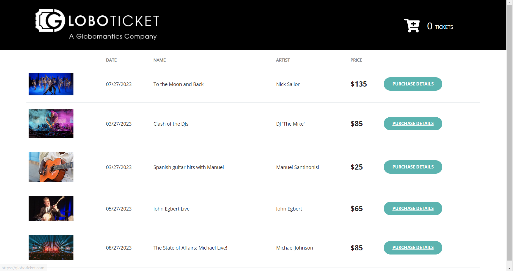
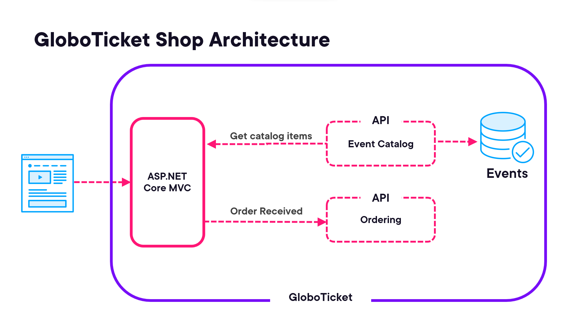

# GloboTicket Demo Application

This application is intended to demonstrate how to deploy an ASP.NET core application to Kubernetes.
It is the demo project for the Pluralsight course: Deploying ASP.NET Core 6 Using Kubernetes by Marcel de Vries (https://app.pluralsight.com/library/courses/asp-dot-net-core-6-kubernetes/table-of-contents) 

## Branches
You can find branches for each demo I did in the course.
Check out the respective branch and you can follow along with the demo's.
If you find anything missing or not in place, please file an issue, so I can follow up and fix this as soon as possible.

## Globoticket website
The globoticket website looks as follows when used:

The website offers a way to buy tickets. You can select the quantity and check out.

## Globoticket Architecture
Globoticket uses two additional web api projects that provide an APIfor getting the 
catalog data and for registering the order when the order is completed.
this is shown in this architectural diagram below:

## Kubernetes deploymens
The course will take a step by step apporach to deploy this application first using containers
on the localhost using docker-compose.
Next the application will be deployed to a local kubernetes cluster running ont he development machine
Then we wil deploy it to a cluster running in Azure, using AKS
Finaly we will optimize the application for use in a kubernetes cluster.
for this we will improve the obeservability, use of environment variables and manage secrets in a better way.
the final step is we will deploy each individual service using CI/CD automation with GitHub Actions or Azure DevOps pipelines.

